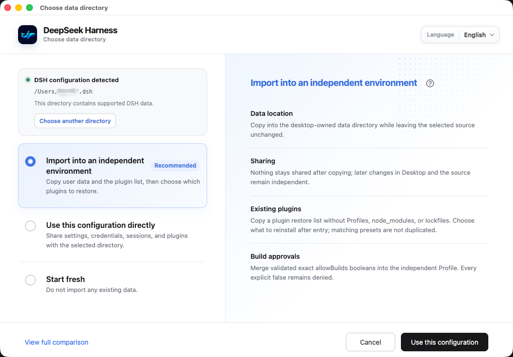
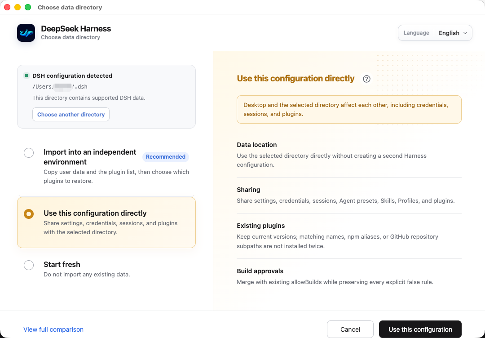
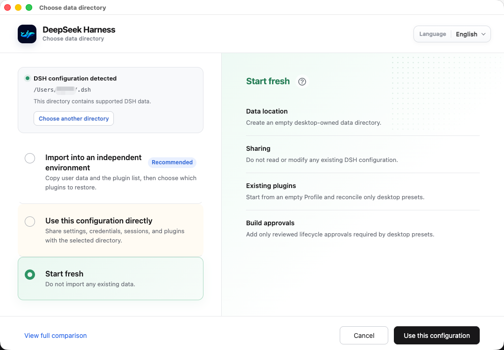
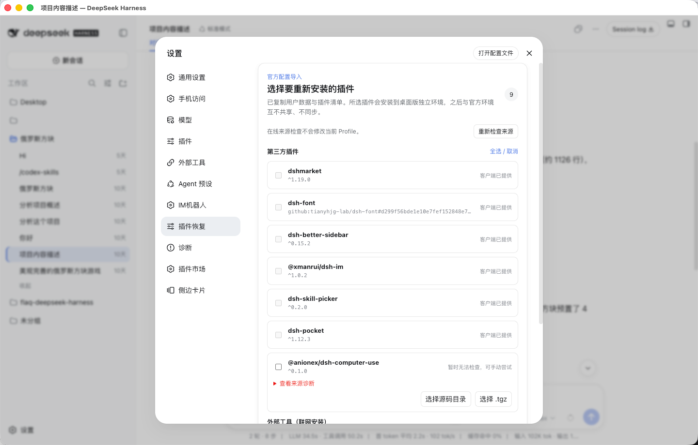
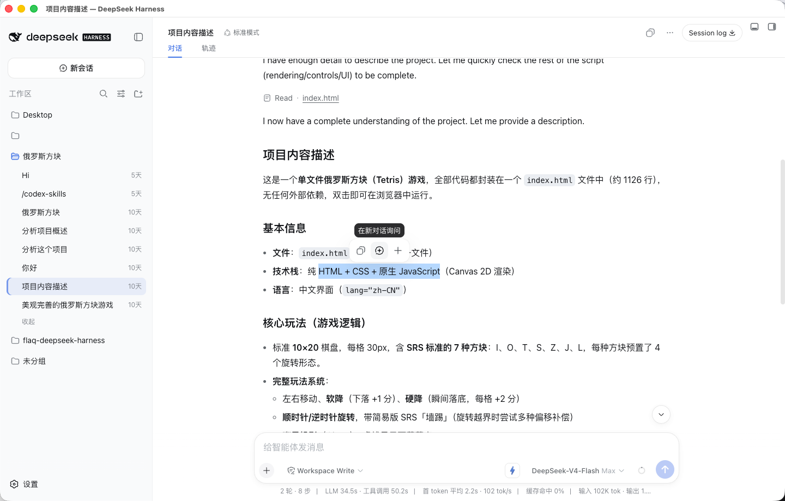
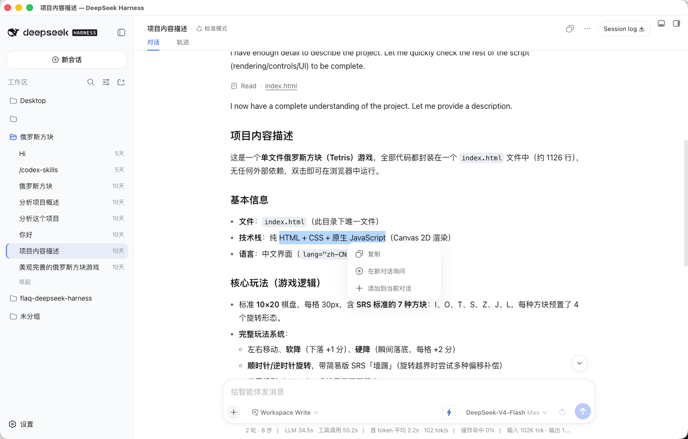
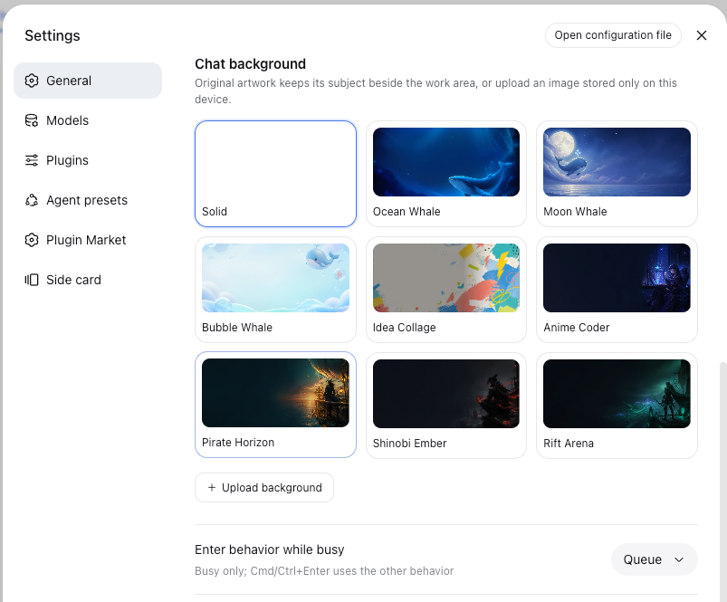

# Open DeepSeek Harness Desktop

<strong>L’édition de bureau communautaire de DeepSeek Harness, prête à l’emploi et renforcée pour la sécurité des dépendances</strong>

Langues : [简体中文](README.md) · [English](README.en.md) · [日本語](README.ja.md) · [한국어](README.ko.md) · [Español](README.es.md) · Français · [Deutsch](README.de.md) · [Português](README.pt-BR.md)

> [!IMPORTANT]
>
> **[v0.1.2-alpha.1 est disponible — téléchargez-la et essayez-la](https://github.com/flaqai/open-deepseek-harness-desktop/releases/tag/odsh-v0.1.2-alpha.1).** Cette version intègre DeepSeek Harness 0.1.2-alpha.1 et ajoute le centre d’exercices de diagnostic, la découverte de plugins en temps réel, une isolation renforcée et une navigation des réglages réorganisable.
>
> Il s’agit d’une préversion Alpha. Sauvegardez les configurations importantes avant la mise à niveau et joignez les journaux ou rapports de diagnostic utiles à vos signalements.

Open DeepSeek Harness Desktop est une distribution indépendante et maintenue par la communauté de [DeepSeek Harness](https://github.com/deepseek-ai/deepseek-harness). Les installateurs incluent Node.js, pnpm et le runtime Harness : configuration des modèles, sessions de code, traces d’exécution, plugins, Skills, outils de code externes et bots IM fonctionnent sans préparer un environnement de développement.

> [!NOTE]
>
> Ce dépôt n’est pas un produit officiel de DeepSeek. Il reste en préversion ; formats de données, politiques de compatibilité et installation peuvent encore évoluer.

## Points forts de cette version

- Importer la configuration officielle dans un environnement indépendant, partager directement un dossier existant ou repartir de zéro.
- Vérifier les sources des plugins et restaurer depuis un dossier source ou une archive .tgz contrôlée.
- Diagnostiquer, réparer et mettre en quarantaine avant le démarrage les conflits pnpm, les doubles instances Cordis, les résidus Loader et les plugins fantômes.
- Copier le texte sélectionné, l’interroger dans une nouvelle conversation ou l’ajouter au brouillon actuel.
- Zone de notification, redémarrage rapide, notifications, journaux, mise à jour intégrée et enregistrement de la commande dsh.
- Paquets Windows x64, macOS arm64/x64 et Linux DEB/RPM.

## Premier démarrage et environnements indépendants

Au premier lancement, le client vérifie le dossier DSH officiel par défaut ~/.dsh. S’il est absent ou non pris en charge, vous pouvez choisir un autre dossier compatible ou créer un environnement vide appartenant à Desktop.

### Importer dans un environnement indépendant

Les réglages, identifiants, sessions, espaces de travail, presets Agent, Skills et connexions sont copiés sans modifier la source. Profiles, node_modules, lockfiles, runtimes de plugins, états de quarantaine et identifiants anonymes ne le sont pas. Les plugins sont réinstallés dans le Profile Desktop ; les changements ultérieurs restent séparés du CLI/Web officiel.

 Copier les données prises en charge sans modifier la source

### Utiliser directement cette configuration

Utilisez ~/.dsh ou un autre dossier compatible sans créer de copie. Réglages, identifiants, sessions, presets Agent, Skills, Profiles et plugins sont partagés ; Desktop et CLI/Web modifient les mêmes données.

 Desktop partage les données du dossier sélectionné

### Repartir de zéro

Créez un environnement vide et indépendant sans lire ni importer les réglages, sessions ou plugins existants.

 Aucune configuration DSH existante n’est lue ou modifiée

L’assistant peut ensuite configurer la clé API du modèle, les bots IM WeChat, Feishu et autres, ainsi qu’une connexion Codex facultative. Chaque étape peut être ignorée et terminée plus tard dans les Réglages.

## Sélection et restauration des plugins importés

L’import indépendant copie la configuration et une liste de restauration, jamais l’ancien node_modules. Chaque entrée reçoit un état : **fourni par le client**, **vérification en cours**, **disponible en ligne**, **source en ligne indisponible** ou **vérification temporairement impossible** en cas de réseau, délai, authentification ou limitation.

Si la source en ligne manque, l’utilisateur peut choisir un dossier source ou un .tgz. Le client valide le nom du paquet, les chemins de l’archive, le manifest et la taille ; un dossier source est remballé avec les scripts de cycle de vie désactivés. Toute restauration passe par les autorisations de build, le diagnostic des dépendances partagées et la quarantaine si nécessaire. L’ancien node_modules et les adresses inconnues ou contenant des identifiants ne sont jamais exécutés directement.

 État des sources, restauration en ligne et restauration locale protégée

## Diagnostics super-renforcés

Les plugins tiers partagent le processus Node.js et le graphe de services Cordis du Host. Une dépendance transitive, le mode de liaison pnpm ou une ancienne entrée Loader peut provoquer des appels d’outil vides, des erreurs .prepare ou une liste de plugins absente avant même l’ouverture des Réglages.

Le diagnostic s’exécute donc dans la composition du Profile et la couche de démarrage, pas dans un plugin ordinaire. Avant tout code tiers, il lit le manifest, pnpm-lock.yaml, les réglages Workspace, l’ordre des Bundles, le graphe réellement installé et le runtime partagé de l’installation courante.

Les Context, Service et Symbol de Cordis dépendent de l’identité physique du module, pas seulement de la version. Deux copies de @deepseek-ai/cordis ou dsh-tools de même version mais de real paths différents restent deux instances JavaScript. L’inspection parcourt chaque plugin racine, les dépendances directes et transitives, les plages déclarées et les chemins résolus ; les peerDependencies valides ne sont pas signalées.

Elle contrôle les singletons Host, la cohérence Profile/lockfile, les Bundles orphelins ou dupliqués, les plugins fantômes, le Store pnpm, les installations incomplètes, allowBuilds, les permissions prepare et la déduplication peer.

L’ordre est **inspection en lecture seule → convergence sans perte → installation du strict nécessaire → nouvelle vérification des real paths → quarantaine si nécessaire**. Un Profile sain ne lance pas pnpm. Les overrides link: gérés ne sont utilisés que pour une plage compatible et ne réduisent jamais minimumReleaseAge ni un allowBuilds: false explicite. Un succès pnpm ne suffit pas : le démarrage reprend seulement après cohérence des chemins physiques et du Loader.

Si la convergence ne peut pas être prouvée sûre, seul le plugin racine responsable est retiré des dépendances actives et de l’ordre des Bundles. Spécification, version, chaîne, motif et date sont conservés. La quarantaine n’est terminée que lorsque le paquet a physiquement quitté le Profile, que les Host partagés pointent vers les copies canoniques et que la nouvelle inspection réussit. Le but est d’expliquer qui a échoué, pourquoi, quelle protection a été appliquée et quoi faire ensuite.

## Sélection de texte et menu contextuel

Sélectionner du texte en lecture seule dans une conversation, une sortie d’outil, un détail ou un aperçu de fichier affiche une barre horizontale. Un clic droit sur la sélection ouvre un menu vertical arrondi.

- **Copier** vers le presse-papiers.
- **Demander dans une nouvelle conversation** sans envoyer automatiquement.
- **Ajouter à la conversation actuelle** sous forme de citation Markdown sans écraser le brouillon.

Quand la session attend un choix, une confirmation ou une réponse, ou que l’éditeur est désactivé, l’ajout à la conversation actuelle disparaît automatiquement.

  <strong>Barre de sélection</strong> 
  

  <strong>Menu contextuel</strong> 
  

## Expérience de bureau

- Exécution en zone de notification, sortie complète et redémarrage rapide depuis macOS ou Windows/Linux.
- Notifications d’échec et de reprise, accès au journal Harness fixe, aide après 15 secondes d’attente.
- Recherche de Release, progression du téléchargement, validation SHA256SUMS et ouverture de l’installateur dans les Réglages généraux.
- Ajout et suppression sûrs de la commande dsh intégrée dans le PATH système.
- Barre de titre personnalisée Windows/Linux, comportement natif macOS, écriture presse-papiers limitée.
- Six archives locales vérifiées : Plugin Marketplace, dsh-im, dsh-skill-picker, dsh-font, Better Sidebar et dsh-pocket. Une désinstallation utilisateur est respectée.
- Codex et Claude Code sont installés à la demande depuis **Réglages → Outils externes**, et non intégrés aux installateurs.

## Thèmes et arrière-plans

Modes système, clair, sombre, huit thèmes produit, huit illustrations intégrées et arrière-plans PNG/JPEG/WebP locaux. Les images personnalisées restent dans le stockage local du navigateur et ne sont pas envoyées au modèle.

<table><tr><th width="50%">Thèmes</th><th width="50%">Arrière-plans</th></tr><tr><td align="center"></td><td align="center"></td></tr></table>

## Télécharger et installer

Téléchargez le paquet adapté depuis [GitHub Releases](https://github.com/flaqai/open-deepseek-harness-desktop/releases).

| Système | Architecture | Paquet |
| --- | --- | --- |
| macOS | Apple Silicon arm64 | DeepSeek-Harness-macos-arm64.dmg |
| macOS | Intel x64 | DeepSeek-Harness-macos-x64.dmg |
| Windows | x64 | DeepSeek-Harness-windows-x64.exe |
| Linux | Debian / Ubuntu x64 | DeepSeek-Harness-linux-x64.deb |
| Linux | Fedora / RHEL x64 | DeepSeek-Harness-linux-x64.rpm |

Vérifiez les fichiers avec SHA256SUMS. Les builds macOS sont signés ad-hoc et non notariés ; si Gatekeeper bloque l’application, utilisez **Réglages Système → Confidentialité et sécurité → Ouvrir quand même**. Windows peut afficher un avertissement de réputation pour une build récente ou non signée.

## Exécuter depuis les sources

Installez Node.js ^22.19.0 ou 24+ et pnpm 11.7.0 :

    git clone https://github.com/flaqai/open-deepseek-harness-desktop.git
    cd open-deepseek-harness-desktop
    pnpm install
    pnpm run build
    pnpm run dev:desktop

Pour Web seulement, utilisez pnpm dsh web. Le Web source utilise le DSH_HOME courant, généralement ~/.dsh ; Desktop installé utilise le dossier choisi au premier lancement. Le partage dépend de ce choix.

## Sécurité, communauté et licence

Le renderer désactive l’intégration Node et active context isolation et le sandbox Chromium. La navigation est limitée à l’origine loopback exacte de Harness ; aucun bridge générique n’expose commandes, fichiers ou URL arbitraires. Stockez les clés API avec le service d’identifiants Harness.

- [Guide utilisateur](docs/user/guide/index.md), [guide des plugins](docs/user/develop/framework/index.md), [guide des Skills](docs/subsystems/skills.md)
- Bugs et idées : [GitHub Issues](https://github.com/flaqai/open-deepseek-harness-desktop/issues)
- Projet amont : [DeepSeek Harness](https://github.com/deepseek-ai/deepseek-harness)

Open DeepSeek Harness Desktop est publié sous [licence MIT](LICENSE). Les licences tierces figurent dans [THIRD_PARTY_NOTICES.md](THIRD_PARTY_NOTICES.md).

## Friends

- [DSHFind](https://dshfind.com/zh) — communauté chinoise d’apprentissage et de partage autour de DeepSeek Harness.
