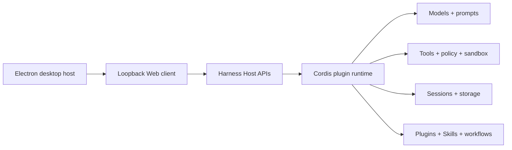

# Open DeepSeek Harness Desktop

English | [简体中文](README.zh.md) | [繁體中文](README_tw.md) | [日本語](README_ja.md) | [한국어](README_ko.md) | [Deutsch](README_de.md) | [Español](README_es.md) | [Français](README_fr.md) | [Italiano](README_it.md) | [Português](README_pt.md) | [Русский](README_ru.md) | [العربية](README_ar.md) | [Bahasa Indonesia](README_id.md) | [ไทย](README_th.md) | [Tiếng Việt](README_vi.md)

Open DeepSeek Harness Desktop is an independent, community-maintained desktop distribution of [DeepSeek Harness](https://github.com/deepseek-ai/deepseek-harness). It combines the upstream plugin-based agent runtime with a visual workspace for configuring models, running coding sessions, inspecting execution, and managing extensions.

This repository is not an official DeepSeek product. It is released under the [MIT License](LICENSE) and keeps the Harness architecture intact: capabilities remain plugins, while the Electron application acts as a secure local host for the existing Web client.

## Developer preview

The project is in developer preview and may introduce breaking changes. macOS is the first locally exercised desktop platform. Windows and Linux packaging, signing, and native validation remain release work rather than supported installer claims.

## What you can do

- Connect to DeepSeek by default or configure a compatible API base URL, API key reference, and custom model identifiers from onboarding or Settings.
- Open local workspaces, create persistent sessions, stream agent responses, copy messages, remove sessions, and clear conversation history.
- Review model-visible execution records and concise key-step summaries so important tool activity is easier to confirm.
- Discover Harness plugins, install supported registry plugins through a reviewed one-click flow, inspect installed plugins, and invoke Skills.
- Personalize the client with color palettes, original built-in backgrounds, and a local custom chat background without obscuring the working area.
- Check the fixed official upstream for stable Harness changes and perform a guarded clean fast-forward update from desktop source runs.
- Extend the product through Cordis plugins instead of storing desktop-only copies of provider, session, plugin, or Skill state.

<a id="run"></a><a id="run-from-source"></a>

## Quick start

Install Node.js `^22.19.0 || >=24.0.0` and pnpm `11.7.0`, then run:

```sh
git clone https://github.com/flaqai/open-deepseek-harness-desktop.git
cd open-deepseek-harness-desktop
pnpm install
pnpm run build
pnpm run dev:desktop
```

The desktop host starts a local Harness process and opens its loopback Web UI in a hardened Electron window. To run only the Web client from the same checkout:

```sh
pnpm dsh web
```

See the [desktop application reference](apps/desktop/README.md) for environment overrides, process supervision, update behavior, and current limitations. The [Web UI guide](docs/user/guide/index.md) covers the browser workflow.

## Platform status

| Platform | Current status | Next release work |
| --- | --- | --- |
| macOS | Desktop source run exercised locally | Package, sign, notarize, and validate arm64/x64 artifacts |
| Windows | Shared Electron/Node implementation present | Build signed installers and validate process, PTY, filesystem, and sandbox behavior |
| Linux | Shared Electron/Node implementation present | Build AppImage/deb artifacts and validate native runtime behavior |
| Web | Available from source through `pnpm dsh web` | Continue sharing the same Harness services and configuration |

## Architecture



DeepSeek Harness follows an **everything is a plugin** architecture powered by [Cordis](https://github.com/cordiverse/cordis). The desktop window does not become a second runtime: configuration, credentials, sessions, plugins, and Skills remain owned by Harness services. Start with the [architecture documentation](docs/architecture.md) and [development guide](docs/development.md) before changing packages.

## Plugins and Skills

The home and Settings surfaces expose plugin discovery and supported installation actions. Registry installation uses validated package specifications, explicit confirmation, streamed command output, and a restart-required result; it is not a generic shell prompt. Add the [`dsh-plugin`](https://github.com/topics/dsh-plugin) topic to a compatible plugin repository so users can find it.

Skills remain managed through Harness providers and are invoked in the same session context as the rest of the agent. Plugin authors should use documented service definitions, providers, consumers, effects, and configuration instead of Electron-only state.

## Security and privacy

The renderer runs with Node integration disabled, context isolation enabled, and Chromium sandboxing enabled. Navigation is restricted to the exact loopback Harness origin, renderer permission requests are denied, and no generic command or filesystem bridge is exposed to Web content.

API keys remain owned by the Harness credentials service. Do not commit credentials. Before selecting any compatible provider, review its endpoint, model support, tool-calling behavior, pricing, rate limits, and data-handling terms.

## Project direction

- Produce reproducible, signed, and platform-native macOS, Windows, and Linux releases with generated third-party notices.
- Improve plugin and Skill discovery, compatibility metadata, lifecycle management, and update visibility.
- Add native approvals, notifications, tray status, deep links, and an authenticated local control endpoint.
- Support WeChat, Discord, Slack, and other IM control through separate authenticated transport plugins with identity mapping, authorization, audit events, rate limits, and revocation.

These items describe direction, not completed support. See the [desktop release plan](apps/desktop/README.md#cross-platform-release-plan) for the current implementation boundary.

## Documentation and community

- Read the [user guide](docs/user/guide/index.md), [plugin introduction](docs/user/develop/framework/index.md), and [Skill guide](docs/subsystems/skills.md).
- Use [GitHub Issues](https://github.com/flaqai/open-deepseek-harness-desktop/issues) for reproducible bugs and feature requests.
- Discuss the upstream runtime in [DeepSeek Harness Discussions](https://github.com/deepseek-ai/deepseek-harness/discussions) or its [Discord community](https://discord.gg/Ycq5dCaS4).
- See [CONTRIBUTING.md](CONTRIBUTING.md) before contributing and [AGENTS.md](AGENTS.md) when working with coding agents in this repository.

## About FLAQ.AI

[FLAQ.AI](https://flaq.ai/) provides access to image, video, audio, and language models through APIs, documentation, and developer-oriented workflows. It can be evaluated as an optional compatible provider or companion platform where its current API and model capabilities fit a project.

FLAQ.AI is not required to run this repository, is not configured as a hidden default, and does not imply endorsement by DeepSeek. Provider availability and commercial terms can change, so confirm current details in the [FLAQ.AI documentation](https://flaq.ai/docs/) before use.

## License

Open DeepSeek Harness Desktop is available under the [MIT License](LICENSE). Third-party dependencies and their licenses are disclosed in [THIRD_PARTY_NOTICES.md](THIRD_PARTY_NOTICES.md).
