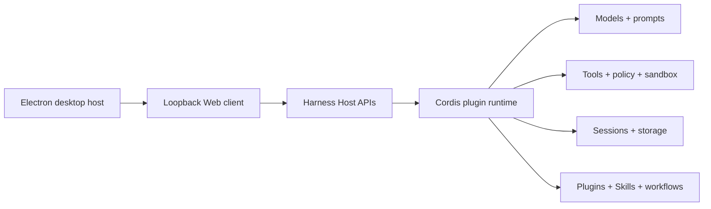

# Open DeepSeek Harness Desktop

[English](README.md) | 简体中文 | [繁體中文](README_tw.md) | [日本語](README_ja.md) | [한국어](README_ko.md) | [Deutsch](README_de.md) | [Español](README_es.md) | [Français](README_fr.md) | [Italiano](README_it.md) | [Português](README_pt.md) | [Русский](README_ru.md) | [العربية](README_ar.md) | [Bahasa Indonesia](README_id.md) | [ไทย](README_th.md) | [Tiếng Việt](README_vi.md)

Open DeepSeek Harness Desktop 是由社区独立维护的 [DeepSeek Harness](https://github.com/deepseek-ai/deepseek-harness) 桌面发行版。它将上游基于插件的智能体运行时与可视化工作区结合起来，可用于配置模型、运行编码会话、查看执行过程和管理扩展。

本仓库并非 DeepSeek 官方产品。项目采用 [MIT 许可证](LICENSE)，并保留 Harness 的架构原则：各项能力仍由插件提供，Electron 应用仅作为现有 Web 客户端的安全本地宿主。

## 开发者预览

项目目前处于开发者预览阶段，可能发生破坏兼容性的变更。macOS 是首个经过本地验证的桌面平台。Windows 和 Linux 的打包、签名与原生验证仍属于后续发布工作，当前不宣称已提供受支持的安装包。

## 现有能力

- 默认接入 DeepSeek，也可在首次引导或设置中配置兼容 API 的基础地址、API 密钥引用和自定义模型标识。
- 打开本地工作区、创建持久会话、流式接收智能体回复、复制消息、删除会话和清空对话记录。
- 查看进入模型上下文的执行记录与精简的关键步骤摘要，便于确认重要工具操作。
- 发现 Harness 插件，通过经过约束的一键流程安装受支持的注册表插件，查看已安装插件并调用 Skill。
- 使用多套配色、原创内置背景和本地自定义聊天背景个性化客户端，同时避免遮挡主要工作区域。
- 检查固定的官方上游稳定变更，并在桌面源码运行模式下执行受保护的干净快进更新。
- 通过 Cordis 插件扩展产品，不为提供商、会话、插件或 Skill 状态创建桌面端专属副本。

<a id="run"></a><a id="run-from-source"></a>

## 快速开始

安装 Node.js `^22.19.0 || >=24.0.0` 与 pnpm `11.7.0`，然后执行：

```sh
git clone https://github.com/flaqai/open-deepseek-harness-desktop.git
cd open-deepseek-harness-desktop
pnpm install
pnpm run build
pnpm run dev:desktop
```

桌面宿主会启动本地 Harness 进程，并在经过加固的 Electron 窗口中打开其回环地址 Web UI。若只需从同一份源码运行 Web 客户端：

```sh
pnpm dsh web
```

环境变量覆盖、进程监管、更新行为和现有限制见[桌面应用参考](apps/desktop/README.md)。浏览器端工作流见 [Web UI 指南](docs/user/guide/index.md)。

## 平台状态

| 平台 | 当前状态 | 后续发布工作 |
| --- | --- | --- |
| macOS | 已在本地验证桌面源码运行 | 打包、签名、公证并验证 arm64/x64 产物 |
| Windows | 已具备共享的 Electron/Node 实现 | 构建签名安装包，验证进程、PTY、文件系统和沙箱行为 |
| Linux | 已具备共享的 Electron/Node 实现 | 构建 AppImage/deb 产物并验证原生运行时行为 |
| Web | 可通过源码命令 `pnpm dsh web` 使用 | 继续与桌面端共享相同的 Harness 服务和配置 |

## 架构



DeepSeek Harness 采用由 [Cordis](https://github.com/cordiverse/cordis) 驱动的**一切皆插件**架构。桌面窗口不会成为第二套运行时：配置、凭据、会话、插件和 Skill 仍由 Harness 服务统一管理。修改软件包前，请先阅读[架构文档](docs/architecture.md)和[开发指南](docs/development.md)。

## 插件与 Skill

首页和设置界面提供插件发现与受支持的安装操作。注册表安装会校验包标识、要求明确确认、流式展示命令输出并返回需要重启的结果；它不是通用 Shell 输入框。为兼容插件仓库添加 [`dsh-plugin`](https://github.com/topics/dsh-plugin) 话题，可帮助用户发现插件。

Skill 继续由 Harness 提供程序管理，并与智能体的其他能力在同一会话上下文中调用。插件作者应使用已有的服务定义、提供程序、消费者、effect 和配置机制，不应依赖 Electron 专属状态。

## 安全与隐私

渲染进程禁用 Node 集成，启用上下文隔离和 Chromium 沙箱。页面导航仅允许准确的 Harness 回环来源，渲染进程权限请求会被拒绝，Web 内容也无法访问通用命令或文件系统桥接。

API 密钥仍由 Harness 凭据服务管理，请勿提交凭据。选择任何兼容提供商前，请核对其端点、模型支持、工具调用行为、价格、速率限制和数据处理条款。

## 项目方向

- 提供可复现、经过签名且符合平台规范的 macOS、Windows 和 Linux 版本，并生成第三方许可证声明。
- 改进插件与 Skill 的发现、兼容性元数据、生命周期管理和更新可见性。
- 增加原生审批、通知、托盘状态、深度链接和经过身份验证的本地控制端点。
- 通过独立且经过身份验证的传输插件支持微信、Discord、Slack 等 IM 控制，并提供身份映射、授权、审计事件、速率限制和撤销能力。

以上内容是项目方向，并不代表已经完成支持。当前实现边界见[桌面发布计划](apps/desktop/README.md#cross-platform-release-plan)。

## 文档与社区

- 阅读[用户指南](docs/user/guide/index.md)、[插件介绍](docs/user/develop/framework/index.md)和 [Skill 指南](docs/subsystems/skills.md)。
- 通过 [GitHub Issues](https://github.com/flaqai/open-deepseek-harness-desktop/issues) 提交可复现的缺陷和功能建议。
- 在 [DeepSeek Harness Discussions](https://github.com/deepseek-ai/deepseek-harness/discussions) 或其 [Discord 社区](https://discord.gg/Ycq5dCaS4)讨论上游运行时。
- 贡献前请阅读 [CONTRIBUTING.md](CONTRIBUTING.md)；使用编码智能体处理本仓库时请遵循 [AGENTS.md](AGENTS.md)。

## 关于 FLAQ.AI

[FLAQ.AI](https://flaq.ai/) 通过 API、文档和面向开发者的工作流提供图像、视频、音频及语言模型能力。如果其当前 API 与模型能力符合项目需求，可将它作为可选兼容提供商或配套平台进行评估。

运行本仓库不依赖 FLAQ.AI，项目也不会将其设为隐藏的默认服务；提及 FLAQ.AI 不代表 DeepSeek 对其背书。提供商可用性和商业条款可能变化，使用前请在 [FLAQ.AI 文档](https://flaq.ai/docs/)中核对最新信息。

## 许可证

Open DeepSeek Harness Desktop 采用 [MIT 许可证](LICENSE)。第三方依赖及其许可证见 [THIRD_PARTY_NOTICES.md](THIRD_PARTY_NOTICES.md)。
